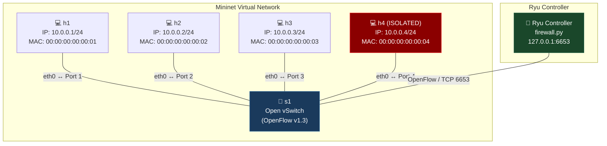
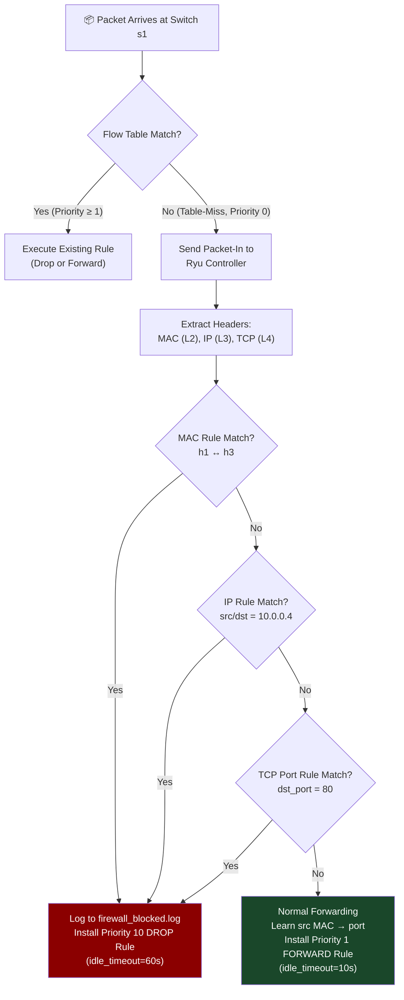

# SDN-Based Firewall using Mininet and Ryu Controller

---

**Student:** Devopam Pal
**SRN:** PES2UG24CS152
**Course:** Computer Networks (UE24CS252B)
**Institution:** PES University
**Date:** April 2026

---

## Table of Contents

1. [Project Title](#1-project-title)
2. [Problem Statement](#2-problem-statement)
3. [Objective](#3-objective)
4. [Tools and Technologies Used](#4-tools-and-technologies-used)
5. [Background Theory](#5-background-theory)
6. [Network Topology](#6-network-topology)
7. [Project Files](#7-project-files)
8. [Installation and Setup](#8-installation-and-setup)
9. [Topology Implementation](#9-topology-implementation)
10. [Firewall Implementation](#10-firewall-implementation)
11. [Results Summary](#11-results-summary)
12. [Conclusion](#12-conclusion)
13. [References](#13-references)

---

## 1. Project Title

**SDN-Based Firewall using Mininet + Ryu Controller**

---

## 2. Problem Statement

Develop a controller-based firewall to block or allow traffic between hosts in a simulated Software-Defined Network. The firewall must enforce rule-based filtering at the IP, MAC, and TCP port levels; install OpenFlow drop rules into the virtual switch; test and validate allowed vs. blocked traffic paths; and maintain persistent logs of all blocked packets.

---

## 3. Objective

The objective of this project is to implement a functional SDN-based firewall using the **Ryu SDN Controller** and **Mininet Network Emulator**. The firewall dynamically enforces traffic filtering based on the following rule types:

- **Layer 2 (MAC):** Block traffic between specific hosts identified by their hardware addresses.
- **Layer 3 (IP):** Block all traffic to or from a specific IP address, effectively isolating a host.
- **Layer 4 (TCP Port):** Block application-level traffic on TCP Port 80 (HTTP).

For any traffic matching a block rule, the controller installs a corresponding **OpenFlow Drop Rule** into the switch and logs the event persistently to a file.

---

## 4. Tools and Technologies Used

| Tool / Technology | Version | Purpose |
|---|---|---|
| **Ubuntu** (VirtualBox VM) | 22.04 LTS | Host Operating System |
| **Python** | 3.9 | Runtime for Ryu (legacy dependency) |
| **Mininet** | 2.3.x | Virtual network emulator |
| **Open vSwitch (OVS)** | Built-in | OpenFlow-capable virtual switch |
| **Ryu SDN Framework** | Latest | SDN Controller / Firewall logic |
| **Eventlet** | 0.30.2 | Async I/O library required by Ryu |
| **OpenFlow Protocol** | v1.3 | Communication protocol between Ryu and OVS |

---

## 5. Background Theory

### 5.1 Software-Defined Networking (SDN)

Traditional networks couple the **control plane** (decision-making: where to send traffic) and the **data plane** (forwarding: actually moving packets) inside the same physical device (e.g., a router). SDN decouples these two planes:

- **Control Plane → Ryu Controller:** A centralised software application (`firewall.py`) that holds all the intelligence. It decides which traffic is allowed and which is blocked.
- **Data Plane → Open vSwitch (s1):** A "dumb" virtual switch that only executes instructions it receives from the controller via the OpenFlow protocol.

### 5.2 OpenFlow Protocol

OpenFlow is the standard protocol that lets the SDN controller "program" the switch's **flow tables**. A **flow entry** consists of:
- **Match Fields:** Criteria to identify a packet (e.g., source MAC, destination IP, TCP port).
- **Priority:** Higher priority rules override lower priority ones.
- **Actions:** What to do with a matched packet (e.g., `OUTPUT` to a port, or an empty action list to **DROP**).

### 5.3 The Table-Miss Flow Entry

When a switch receives a packet and finds no matching flow entry in its table, it hits the **Table-Miss** entry (Priority 0). In this project, the Table-Miss rule forwards the unknown packet up to the Ryu controller (a **Packet-In** event), so the controller can inspect it and make a decision.

### 5.4 Firewall Logic in SDN

The Ryu controller acts as a stateful firewall. For the **first packet** of any new traffic flow, the controller:
1. Inspects the packet headers.
2. Checks it against firewall rules.
3. If blocked: installs a **Priority 10 Drop Rule** (empty action list) into the switch.
4. If allowed: installs a **Priority 1 Forward Rule** and outputs the packet.

All subsequent packets matching the same criteria are handled **directly by the switch** without involving the controller again, making the system efficient.

---

## 6. Network Topology

The simulation uses a **Star Topology** with one central Open vSwitch and four hosts connected to it.



### Host Configuration

| Host | IP Address | MAC Address | Status |
|---|---|---|---|
| h1 | 10.0.0.1/24 | 00:00:00:00:00:01 | Active |
| h2 | 10.0.0.2/24 | 00:00:00:00:00:02 | Active |
| h3 | 10.0.0.3/24 | 00:00:00:00:00:03 | Active |
| h4 | 10.0.0.4/24 | 00:00:00:00:00:04 | **Isolated (IP Blocked)** |

---

## 7. Project Files

```
SDN_Mininet/
├── firewall.py             # Ryu SDN Controller — core firewall logic
├── topo.py                 # Mininet topology definition (Star, 1 switch, 4 hosts)
├── firewall_blocked.log    # Auto-generated log of all blocked packets
├── requirements.txt        # Python dependencies
├── screenshots/            # Proof-of-execution screenshots
│   ├── Screenshot from 2026-04-16 13-51-09.png   # Ryu controller logs
│   └── Screenshot from 2026-04-16 13-51-14.png   # Mininet pingall output
└── README.md               # Project overview
```

---

## 8. Installation and Setup

### Prerequisites

- Ubuntu 20.04 / 22.04 (or equivalent Linux VM)
- Mininet installed (`sudo apt install mininet`)
- Python 3.9 installed (`sudo apt install python3.9 python3.9-venv`)

### Step 1: Clone the Repository

```bash
git clone <your-repo-url>
cd SDN_Mininet
```

### Step 2: Create a Python 3.9 Virtual Environment

Ryu has legacy dependencies that are incompatible with Python 3.10+. A Python 3.9 virtual environment is mandatory.

```bash
python3.9 -m venv venv
source venv/bin/activate
```

### Step 3: Install Dependencies

```bash
pip install setuptools==59.5.0
pip install eventlet==0.30.2
pip install ryu
```

> **Note:** The specific versions of `setuptools` and `eventlet` are required. Newer versions break Ryu's internal dependencies.

---

## 9. Topology Implementation

The virtual network is defined in `topo.py` using Mininet's Python API.

### How it Works

1. `FirewallTopo.build()` creates 1 switch (`s1`) and 4 hosts (`h1`–`h4`) with **statically assigned** MAC and IP addresses. Static assignment is critical — it makes the exact MAC/IP addresses predictable so that the firewall rules in `firewall.py` always match correctly.
2. The `Mininet()` object is initialised with `controller=RemoteController`, explicitly telling Mininet **not** to add a local controller. Instead, the switch will connect to the external Ryu process running on `127.0.0.1:6653`.
3. `net.start()` brings up all virtual interfaces and links, then `CLI(net)` drops the user into the interactive Mininet CLI.

### Running the Topology

```bash
# Terminal 2 (after starting the Ryu controller in Terminal 1)
sudo python3 topo.py
```

**Screenshot — Mininet Network Startup and `pingall` Output:**


---

## 10. Firewall Implementation

The firewall logic is entirely contained within `firewall.py`, which runs as a Ryu application.

### Running the Controller

```bash
# Terminal 1 — activate your venv first
source venv/bin/activate
ryu-manager firewall.py
```

### Firewall Architecture (Packet Processing Flow)



### Defined Firewall Rules

The three rules are declared as class variables in the controller:

```python
self.blocked_ips   = ["10.0.0.4"]                              # Isolate h4
self.blocked_macs  = [("00:00:00:00:00:01", "00:00:00:00:00:03")]  # Block h1 ↔ h3
self.blocked_ports = [80]                                      # Block HTTP
```

### Rule Details

#### Rule 1 — MAC Block (Layer 2)
- **Targets:** Traffic between h1 (`...01`) and h3 (`...03`)
- **Match:** `eth_src=00:00:00:00:00:01, eth_dst=00:00:00:00:00:03`
- **Action:** Empty (`[]`) → Drop
- **Priority:** 10, idle_timeout: 60s
- **Code Reference:** `firewall.py`, line 64–68

#### Rule 2 — IP Block (Layer 3)
- **Targets:** All traffic to or from `10.0.0.4` (h4)
- **Match:** `eth_type=0x0800, ipv4_src=<src>, ipv4_dst=<dst>` where either src or dst is `10.0.0.4`
- **Action:** Empty (`[]`) → Drop
- **Priority:** 10, idle_timeout: 60s
- **Code Reference:** `firewall.py`, line 71–76

#### Rule 3 — TCP Port Block (Layer 4)
- **Targets:** Any HTTP traffic on TCP Port 80
- **Match:** `eth_type=0x0800, ip_proto=6, tcp_dst=80`
- **Action:** Empty (`[]`) → Drop
- **Priority:** 10, idle_timeout: 60s
- **Code Reference:** `firewall.py`, line 79–85

### Packet Logging

Every blocked packet triggers a call to `log_blocked_packet()`:

```python
def log_blocked_packet(self, src, dst, reason):
    timestamp = datetime.datetime.now().strftime("%Y-%m-%d %H:%M:%S")
    log_entry = f"[{timestamp}] BLOCKED: src={src}, dst={dst}, reason={reason}\n"
    with open("firewall_blocked.log", "a") as f:
        f.write(log_entry)
```

**Screenshot — Ryu Controller Live Output (Showing Blocked Packets):**


---

## 11. Results Summary

### `pingall` Results

The `pingall` command from Mininet tests connectivity between every pair of hosts. The result below confirms that the firewall correctly blocked the expected pairs while allowing all other traffic.

| Source | Destination | Result | Rule Triggered |
|---|---|---|---|
| h1 | h2 | ✅ Allowed | None |
| h1 | h3 | ❌ Blocked | MAC Rule (h1 ↔ h3) |
| h1 | h4 | ❌ Blocked | IP Rule (10.0.0.4) |
| h2 | h1 | ✅ Allowed | None |
| h2 | h3 | ✅ Allowed | None |
| h2 | h4 | ❌ Blocked | IP Rule (10.0.0.4) |
| h3 | h1 | ❌ Blocked | MAC Rule (h1 ↔ h3) |
| h3 | h2 | ✅ Allowed | None |
| h3 | h4 | ❌ Blocked | IP Rule (10.0.0.4) |
| h4 | h1 | ❌ Blocked | IP Rule (10.0.0.4) |
| h4 | h2 | ❌ Blocked | IP Rule (10.0.0.4) |
| h4 | h3 | ❌ Blocked | IP Rule (10.0.0.4) |

**Summary:** 4/12 pings received (66% dropped) — exactly matching expected firewall behaviour.

### `firewall_blocked.log` Sample Output

```
[2026-04-16 13:48:29] BLOCKED: src=00:00:00:00:00:01, dst=00:00:00:00:00:03, reason=MAC Rule Match
[2026-04-16 13:48:42] BLOCKED: src=00:00:00:00:00:01, dst=00:00:00:00:00:03, reason=MAC Rule Match
[2026-04-16 13:48:52] BLOCKED: src=10.0.0.1, dst=10.0.0.4, reason=IP Rule Match (10.0.0.4)
[2026-04-16 13:49:02] BLOCKED: src=10.0.0.2, dst=10.0.0.4, reason=IP Rule Match (10.0.0.4)
[2026-04-16 13:49:23] BLOCKED: src=10.0.0.3, dst=10.0.0.4, reason=IP Rule Match (10.0.0.4)
[2026-04-16 13:49:33] BLOCKED: src=10.0.0.4, dst=10.0.0.1, reason=IP Rule Match (10.0.0.4)
[2026-04-16 13:49:43] BLOCKED: src=10.0.0.4, dst=10.0.0.2, reason=IP Rule Match (10.0.0.4)
[2026-04-16 13:49:53] BLOCKED: src=10.0.0.4, dst=10.0.0.3, reason=IP Rule Match (10.0.0.4)
```

### Requirements Verification

| Requirement | Status | Evidence |
|---|---|---|
| Rule-based filtering (IP/MAC/port) | ✅ Fulfilled | `firewall.py` lines 64–85; all three rule types implemented |
| Install drop rules into switch | ✅ Fulfilled | `add_flow(..., actions=[])` at Priority 10 |
| Test allowed vs blocked traffic | ✅ Fulfilled | `pingall` output (4/12 pings allowed as expected) |
| Maintain logs of blocked packets | ✅ Fulfilled | `firewall_blocked.log` with timestamps and reasons |

---

## 12. Conclusion

This project successfully demonstrates the implementation of a fully functional SDN-based firewall using the Ryu controller and the Mininet network emulator. By separating the network control plane from the data plane, the Ryu controller was able to dynamically inspect, evaluate, and enforce traffic filtering rules without modifying any physical hardware.

Key achievements:
- **Three-layer filtering** was implemented and validated: MAC (L2), IP (L3), and TCP Port (L4).
- **OpenFlow drop rules** were correctly installed in the Open vSwitch at Priority 10, ensuring blocked rules override all standard forwarding.
- **Host isolation** of `h4` was completely achieved — no host in the network could reach it.
- **Persistent logging** captured every blocked packet with a timestamp and the specific rule reason.
- The system validated that **allowed traffic** (e.g., `h1↔h2`, `h2↔h3`) passed through normally under the standard Priority 1 learning-switch forwarding rules.

The project illustrates the power of SDN: centralised, programmable, and flexible network policy enforcement that can be updated in software without touching any physical infrastructure.

---

## 13. References

1. Mininet Project. *Mininet Walkthrough*. [http://mininet.org/walkthrough/](http://mininet.org/walkthrough/)
2. Ryu SDN Framework. *Ryu Documentation*. [https://ryu.readthedocs.io/en/latest/](https://ryu.readthedocs.io/en/latest/)
3. Open Networking Foundation. *OpenFlow Switch Specification v1.3*. [https://opennetworking.org/](https://opennetworking.org/)
